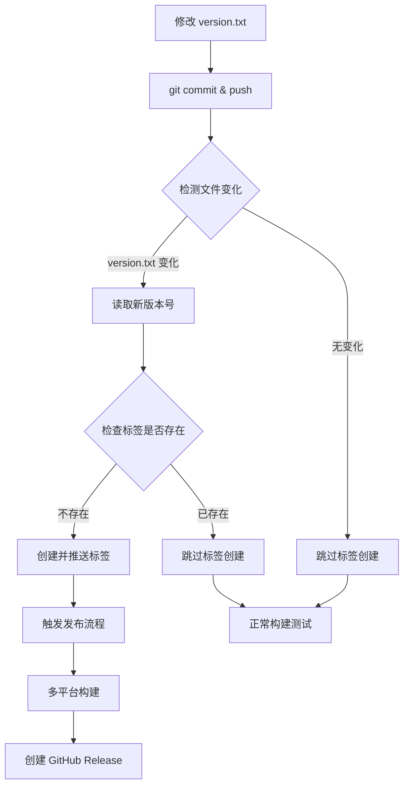

# 🏷️ 自动版本标签创建指南

## 📋 功能概述

现在你的 VideoDown-Go 项目支持**完全自动化的版本管理**！

✅ **自动检测** `version.txt` 文件变化  
✅ **自动创建** Git 标签  
✅ **自动触发** 发布流程  
✅ **智能跳过** 重复标签  

## 🚀 使用方法

### 方法一：简单版本发布（推荐）

只需要两步即可完成版本发布：

```bash
# 1. 更新版本号
echo "V1.4.0" > version.txt

# 2. 提交并推送
git add version.txt
git commit -m "chore: 发布版本 V1.4.0"
git push origin main
```

**自动执行流程：**
1. 🔍 GitHub Actions 检测到 `version.txt` 变化
2. 🏷️ 自动创建标签 `V1.4.0`
3. 🚀 自动触发发布流程
4. 📦 生成多平台二进制文件
5. 📝 创建 GitHub Release

### 方法二：传统手动标签（仍然支持）

如果你喜欢手动控制，仍然可以：

```bash
# 手动创建标签
git tag V1.4.0
git push origin V1.4.0
```

## 🔧 工作原理

### 触发条件

自动标签创建会在以下情况触发：
- ✅ 推送到 `main` 或 `master` 分支
- ✅ `version.txt` 文件被修改
- ✅ 新版本号不存在重复标签

### 智能检测

```yaml
# 检查文件变化
if git diff --name-only HEAD~1 HEAD | grep -q "version.txt"; then
  NEW_VERSION=$(cat version.txt)
  # 检查标签是否已存在
  if git tag -l | grep -q "^$NEW_VERSION$"; then
    echo "标签已存在，跳过创建"
  else
    echo "创建新标签: $NEW_VERSION"
  fi
fi
```

### 版本号格式支持

支持多种版本号格式：
- `V1.4.0` （推荐）
- `v1.4.0`
- `1.4.0`
- `V1.4.0-beta`
- `v2.0.0-rc1`

## 📊 完整工作流程



## 🛠️ 高级配置

### 自定义触发路径

当前配置监控这些文件变化：
```yaml
paths:
  - 'version.txt'    # 版本文件
  - '**/*.go'        # Go 源码
  - 'go.mod'         # 依赖文件
  - 'go.sum'         # 依赖锁定
```

### 修改版本文件位置

如果你想使用不同的版本文件：

```yaml
# 在 .github/workflows/go.yml 中修改
paths:
  - 'VERSION'        # 使用 VERSION 文件
  - 'package.json'   # 或其他文件
```

对应的检测脚本也需要修改：
```bash
# 修改文件名检测
if git diff --name-only HEAD~1 HEAD | grep -q "VERSION"; then
  NEW_VERSION=$(cat VERSION)
```

## 🐛 故障排除

### 常见问题

**1. 标签创建失败**
```
Error: failed to push some refs
```
**解决方案：** 检查仓库权限，确保 Actions 有写入权限

**2. 重复标签警告**
```
Tag V1.4.0 already exists, skipping tag creation
```
**解决方案：** 这是正常行为，系统会智能跳过重复标签

**3. 版本号格式错误**
```
Invalid version format
```
**解决方案：** 确保 `version.txt` 内容格式正确，如 `V1.4.0`

### 调试方法

1. **查看 Actions 日志**
   - 进入 GitHub 仓库 → Actions 标签页
   - 查看 "Auto Create Tag" 步骤的详细日志

2. **手动测试版本检测**
   ```bash
   # 本地测试
   git diff --name-only HEAD~1 HEAD | grep version.txt
   cat version.txt
   ```

3. **检查现有标签**
   ```bash
   git tag -l
   ```

## 📈 最佳实践

### 版本号规范

建议使用语义化版本：
- **主版本号**：不兼容的 API 修改
- **次版本号**：向下兼容的功能性新增
- **修订号**：向下兼容的问题修正

示例：`V1.4.2` → `V1.5.0` → `V2.0.0`

### 提交信息规范

```bash
# 功能更新
git commit -m "feat: 添加视频批量下载功能"

# 版本发布
git commit -m "chore: 发布版本 V1.4.0"

# 问题修复
git commit -m "fix: 修复下载进度显示问题"
```

### 发布时机

- 🎯 **功能完善后发布**：确保新功能稳定
- 🚨 **重要修复及时发布**：安全问题和严重 bug
- 📅 **定期发布**：积累一定改进后统一发布

## 🎉 总结

现在你只需要：
1. 修改 `version.txt`
2. 提交推送代码
3. 坐等自动发布完成！

**完全自动化，零手动操作！** 🚀

---

💡 **提示**：首次使用建议先在测试分支验证流程，确认无误后再在主分支使用。