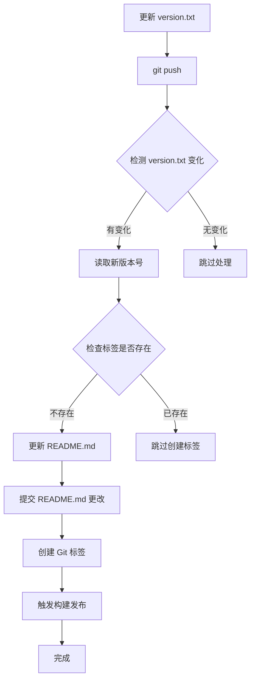

# README.md 版本号自动更新功能 📝

## 🎯 功能概述

现在当您更新 `version.txt` 文件并提交到 GitHub 时，系统会自动：
1. 检测 `version.txt` 文件的变化
2. 自动更新 `README.md` 中的版本号
3. 提交 README.md 的更改
4. 创建对应的 Git 标签
5. 触发自动构建和发布流程

## 🚀 使用方法

### 方法一：直接更新版本文件（推荐）

```bash
# 1. 更新版本号
echo "V1.4.1" > version.txt

# 2. 提交并推送
git add version.txt
git commit -m "bump version to V1.4.1"
git push origin main
```

**自动执行的操作：**
- ✅ 自动更新 README.md 中的版本号
- ✅ 自动提交 README.md 更改
- ✅ 自动创建 Git 标签 `V1.4.1`
- ✅ 自动触发构建和发布流程

### 方法二：同时更新多个文件

```bash
# 1. 更新版本号
echo "V1.4.1" > version.txt

# 2. 同时更新其他文件（如果需要）
# 编辑其他需要更新的文件...

# 3. 一次性提交所有更改
git add .
git commit -m "release V1.4.1: add new features"
git push origin main
```

## 🔧 自动更新规则

### README.md 中会被自动更新的内容：

1. **主标题版本号**
   ```markdown
   # X-KT 视频下载器 🎥 v1.3.2
   # ↓ 自动更新为 ↓
   # X-KT 视频下载器 🎥 V1.4.1
   ```

2. **版本更新章节标题**
   ```markdown
   ## 🐛 v1.3.2 BUG修复
   ## 🆕 v1.3.0 新功能  
   ## 🔄 v1.2.0 更新内容
   # ↓ 自动更新为 ↓
   ## 🐛 V1.4.1 BUG修复
   ## 🆕 V1.4.1 新功能
   ## 🔄 V1.4.1 更新内容
   ```

### 版本号格式支持：
- ✅ `V1.4.1` (推荐格式)
- ✅ `v1.4.1`
- ✅ `1.4.1`

## 📋 工作流程详解



## ⚙️ 高级配置

### 自定义版本号格式

如果您需要修改版本号的匹配规则，可以编辑 `.github/workflows/go.yml` 文件中的正则表达式：

```bash
# 当前匹配规则：v1.2.3 格式
sed -i "1s/# X-KT 视频下载器 🎥 v[0-9]\+\.[0-9]\+\.[0-9]\+/# X-KT 视频下载器 🎥 $VERSION/" "$README_PATH"

# 如需支持其他格式，可修改正则表达式
```

### 添加更多自动更新内容

在 GitHub Actions 工作流中的 "Update README.md version" 步骤中添加更多 `sed` 命令：

```bash
# 例如：更新下载链接中的版本号
sed -i "s/releases\/download\/v[0-9]\+\.[0-9]\+\.[0-9]\+/releases\/download\/$VERSION/g" "$README_PATH"
```

## 🛠️ 故障排除

### 常见问题

**Q: README.md 没有自动更新？**
A: 检查以下几点：
- 确保 `version.txt` 文件确实发生了变化
- 检查 GitHub Actions 是否正常运行
- 确认推送到的是 `main` 或 `master` 分支

**Q: 创建了重复的标签？**
A: 系统会自动检查标签是否已存在，如果存在会跳过创建。如果仍有问题，请检查 Git 标签列表。

**Q: 版本号格式不匹配？**
A: 确保 `version.txt` 中的版本号格式符合要求（如 `V1.4.1`），并检查 README.md 中的版本号格式是否一致。

### 手动触发更新

如果需要手动更新 README.md 版本号：

```bash
# 读取版本号
VERSION=$(cat version.txt)

# 更新 README.md
sed -i "1s/# X-KT 视频下载器 🎥 v[0-9]\+\.[0-9]\+\.[0-9]\+/# X-KT 视频下载器 🎥 $VERSION/" README.md

# 提交更改
git add README.md
git commit -m "docs: update README.md version to $VERSION"
git push
```

## 📚 相关文档

- [GitHub Actions 自动构建指南](GITHUB_ACTIONS_GUIDE.md)
- [自动版本标签指南](AUTO_VERSION_GUIDE.md)
- [版本修复说明](ACTIONS_VERSION_FIX.md)

## 🎉 最佳实践

1. **版本号规范**：使用语义化版本号（如 `V1.4.1`）
2. **提交信息**：使用清晰的提交信息（如 `bump version to V1.4.1`）
3. **发布时机**：在功能完成并测试通过后再更新版本号
4. **文档同步**：确保版本更新时同步更新相关文档
5. **测试验证**：发布后验证自动构建的二进制文件是否正常

---

**注意**：此功能完全自动化，无需手动干预。只需更新 `version.txt` 文件并推送，系统会自动处理其余所有步骤。